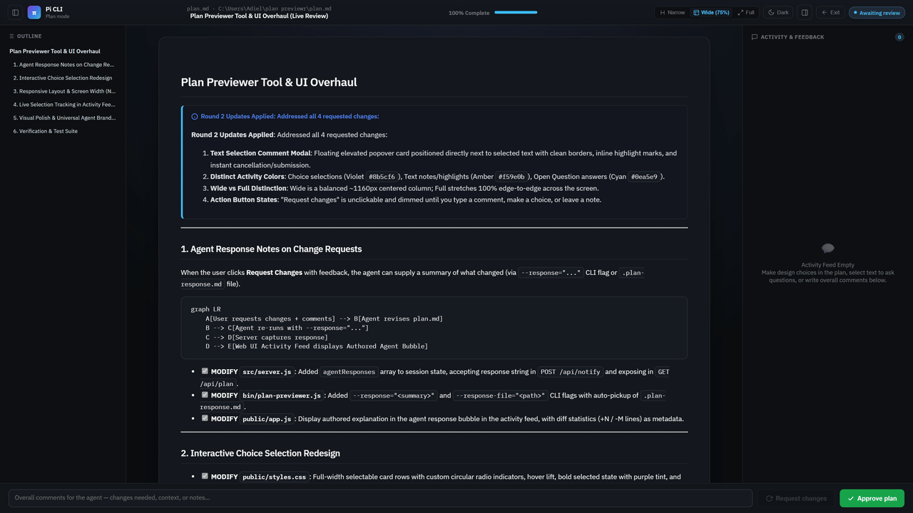

# Plan Previewer

An interactive visual markdown plan previewer and feedback system built for AI coding agents such as Claude Code, Antigravity, and Pi CLI.
It provides an automated web interface for previewing rendered markdown plans, live editing plan tasks, making text-selection annotations, appending feedback, and transmitting user approval back to your active agent session.



## Key Features

- **Multi-Agent Auto-Detection**: Automatically detects whether the session was opened by Claude Code, Antigravity, or Pi CLI - first from agent-specific environment variables (`CLAUDE_*`, `ANTIGRAVITY_*`/`AGY_*`, `PI_*`), then by inspecting parent process trees (`process.ppid`) - without needing manual selection. Pi CLI is identified by its host `PI_*` variables, so a Pi session running an Anthropic model is still reported as Pi CLI, not Claude Code.
- **Claude Design Handoff Aesthetic**: Built using the dark canvas aesthetic with IBM Plex typography, OKLCH teal accents, and inline highlight badges.
- **Text Selection Annotations**: Highlight text anywhere in the plan preview to open a floating question popover (`"Quote snippet..."`, input box, `Cancel`, and `Ask →`).
- **Realtime Live File Sync**: Uses `fs.watch` and lightweight version polling to update the document, task progress metrics, and rendered markdown live whenever the plan file changes on disk via CLI.
- **Auto Tab Shutdown**: Automatically closes the browser tab and terminates the server process upon clicking **Approve plan**, **Request changes**, or exiting the viewer.
- **Ultra Token-Lean Footprint**: Output feedback and agent skill files are optimized (~30 words) to minimize LLM context window consumption.
- **Enforced, Not Just Documented (Claude Code)**: Installs a `PreToolUse` hook on `ExitPlanMode` that blocks the agent from exiting plan mode unless a fresh, `"approved"` `.plan-feedback.json` exists next to the plan file. This removes the ability for an agent to skip the previewer by reasoning that a particular task "doesn't need it."

## Installation & Setup

Install globally via npm:

```bash
npm install -g plan-previewer
```

Register skills and mandatory agent rules across Claude Code, Antigravity, and Pi CLI:

```bash
plan-previewer install --auto
```

Or re-run skill setup anytime:

```bash
npx plan-previewer install
```

### Enforcement Hook (Claude Code)

`plan-previewer install` also copies `hooks/require-plan-previewer.mjs` to `~/.claude/hooks/` and registers it as a `PreToolUse` hook on `ExitPlanMode` in `~/.claude/settings.json` (merged in, existing settings are preserved). Before Claude Code is allowed to leave plan mode, the hook checks the most recently written plan file under `~/.claude/plans/` and denies the call unless `.plan-feedback.json` next to it is newer than the plan and has `status: "approved"`. Re-running `plan-previewer install` is idempotent; it will not duplicate the hook entry.

### Pi CLI

`plan-previewer install` writes the skill to `~/.pi/agent/skills/plan-previewer/SKILL.md` (alongside `rich-plan-formatting`) and appends the mandatory execution rule to Pi's global context file at `~/.pi/agent/AGENTS.md`. The skill is also installed to `~/.agents/skills/`, which Pi loads as well.

Pi CLI needs no enforcement hook or stop hook: its `bash` tool runs commands synchronously in the foreground, so `npx plan-previewer ./plan.md` simply blocks the agent's turn until the user approves or requests changes in the browser - the same flow as Claude Code.

Pi's `bash` tool also applies **no timeout** when the agent omits one, so an unbounded wait would freeze the turn until manually aborted. Under Pi, the CLI therefore defaults `--wait-timeout` to **240 seconds** and relies on the documented "re-run the same command" loop; the detached server and the open browser tab both survive between runs, so the review picks up exactly where it left off. Other harnesses cut long commands off themselves and keep the long default. An explicit `--wait-timeout` always wins.

## How It Works

```
┌────────────────────────┐      ┌─────────────────────────┐      ┌────────────────────────┐
│  AI Agent              │ ---> │ CLI Binary              │ ---> │ Local Web Server       │
│ (Claude/AGY/Pi CLI)    │      │ plan-previewer ./plan.md│      │ (Auto-detects Agent)   │
└────────────────────────┘      └─────────────────────────┘      └────────────────────────┘
                                                                             │
                                                                             ▼
┌────────────────────────┐      ┌─────────────────────────┐      ┌────────────────────────┐
│ Agent Continues Task   │ <--- │ .plan-feedback.json     │ <--- │ Browser Web Viewer     │
│ (Reads User Feedback)  │      │ (Written on Submit)     │      │ (Auto-closes on Done)  │
└────────────────────────┘      └─────────────────────────┘      └────────────────────────┘
```

## Usage

Preview any markdown plan file:

```bash
plan-previewer ./plan.md
```

Specify session context or custom port:

```bash
plan-previewer ./plan.md --context="Building Realtime Notification System" --port=3456
```

Explicitly override caller agent detection:

```bash
plan-previewer ./plan.md --agent=claude
plan-previewer ./plan.md --agent=pi
```

## CLI Options

| Flag | Description | Default |
|---|---|---|
| `[path]` | Path to target markdown plan file | `./plan.md` |
| `--context=<string>`, `-c` | Task goal or session context summary | First `# Heading` |
| `--agent=<claude\|antigravity\|pi>` | Explicitly set calling agent | Auto-detected |
| `--wait-timeout=<seconds>` | Max wait for a review decision before exiting | 240 under Pi CLI, otherwise unbounded |
| `--port=<number>`, `-p` | Local HTTP server port | `3456` |
| `--no-open` | Do not automatically launch browser tab | `false` |
| `install` | Install agent skills into Claude, Antigravity, and Pi CLI | N/A |

## License

MIT License. Created for agentic software workflows.
