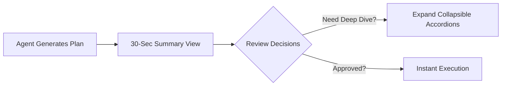

# Plan Previewer: Human-Readable Progressive Disclosure & Visual Polish

> [!NOTE]
> **Executive Summary**: Upgraded Plan Previewer to prioritize human readability with a 30-second scanning experience by default. Deep technical details, long code snippets, and verification suites are organized into sleek, collapsible accordion cards with high-contrast executive summaries and choice blocks.

---

## High-Level Architecture & Strategy

- **Progressive Disclosure**: High-level strategy and key decisions are immediately visible on canvas; low-level implementation details are tucked into styled `<details>` accordions.
- **Dual View Modes**: Switch between **Summary Mode** (compact 30-second scan) and **Full Mode** (all details expanded) with one click in the top header.
- **Ultra-Clean Theme Palette**: Ultra-clean GitHub/Vercel/Linear design palette for both Light and Dark modes with zero background visual noise and crisp text contrast.



---

## Key Decisions & Options

> [!CHOICE] Default View Density Mode
> **Question**: Which view mode should Plan Previewer open with by default for new plans?
> - (x) **Option A**: Summary View (Collapses `<details>` deep-dives by default for 30-second quick scanning) [Recommended]
> - ( ) **Option B**: Full View (Expands all accordions and code blocks on launch)

> [!CHOICE] Theme & Color Scheme
> **Question**: How does this ultra-clean modern palette (GitHub/Vercel crisp contrast) look and feel?
> - (x) **Option A**: Great — clean, high-contrast, comfortable for long reading [Recommended]
> - ( ) **Option B**: Needs Further Adjustment

> [!QUESTION] Additional Customization Ideas
> **Question**: Are there any additional layout or interaction features you would like added to the viewer?

---

## Execution Milestones

- [x] 1. Implement progressive disclosure skill (`rich-plan-formatting`)
- [x] 2. Add Summary vs Full view switcher in header with section folding
- [x] 3. Style `<details>` and `<summary>` accordions with smooth rotating chevrons & badges
- [x] 4. Fix choice card selection persistence bug on re-render / feedback submission
- [x] 5. Fix agent waiting typing indicator to only dismiss when agent actually updates plan
- [x] 6. Polish Light & Dark theme palettes for high readability
- [x] 7. Add SVG favicon to browser tab

---

<details>
<summary>🔍 Deep Dive: Architecture & Implementation Details</summary>

### Progressive Disclosure System
1. **Zero-DOM Mutation Design**: Retains native DOM structure so text selection, question popovers, and interactive radio choices remain 100% reliable.
2. **Choice Card State Persistence**: Restores selected radio buttons and draft question answers from session memory across re-renders and change requests.
3. **Smart Polling & Typing Indicator**: Tracks actual file content diffs and agent response timestamps so the typing indicator stays active while the agent works and only marks requests as addressed when updates land.

```javascript
// Example: View mode toggle logic
function applyCurrentViewMode() {
  const container = document.getElementById('renderedOutput');
  const isSummary = state.viewMode === 'summary';
  container.querySelectorAll('details').forEach(d => {
    if (isSummary) d.removeAttribute('open');
    else d.setAttribute('open', '');
  });
}
```
</details>

<details>
<summary>📁 File Changes Summary (5 files)</summary>

- `public/styles.css` `[MODIFY]`: Refined color variables for light and dark themes, styled `<details>` & code blocks.
- `public/app.js` `[MODIFY]`: Added view switcher, details processing, choice selection restoration, and accurate polling.
- `public/index.html` `[MODIFY]`: Added View Mode controls and SVG tab favicon link.
- `public/favicon.svg` `[NEW]`: Custom vector favicon for browser tab.
- `skills/rich-plan-formatting/SKILL.md` `[MODIFY]`: Standardized progressive disclosure guidelines.
</details>

<details>
<summary>🧪 Verification & Automated Test Suite</summary>

- Run full test suite: `npm test` (38 passing tests)
- Verification checklist:
  - Theme toggle (Light/Dark mode contrast)
  - View mode toggle (Summary / Full)
  - Choice selection persistence
  - Agent response waiting indicator
  - Copy button functionality on code blocks
  - Browser tab SVG favicon rendering
</details>
