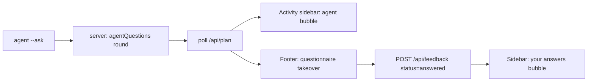

<!-- SUMMARY -->
# Agent Questions: Move Them Into the Chat, Not the Plan (Executive Summary)

> [!NOTE]
> **Executive Summary**: Round 1 shipped the in-tab Q&A channel (`--ask` → same tab → `answers[]` back to the CLI). But it renders questions as a panel *inside the plan document*, which reads like plan content. Round 2 moves them where they belong: an **agent chat bubble in the Activity sidebar**, plus a **footer takeover** that replaces the comment box with a CLI-style questionnaire (options + always-available free text). Effort: UI-only, no server/CLI/protocol changes.

## What's wrong today

| Now | Should be |
|---|---|
| Sticky `[!QUESTION]`-looking panel at the top of the plan body | Message from the agent in the Activity chat stream |
| Answers typed inside the document flow | Footer comment box is **taken over** by the question UI |
| Feels like plan content | Feels like the agent asking you something |

## Core Concept

- **Sidebar** = the record: *"<Agent> asked you 3 questions"* bubble, then your answers as a user bubble once sent.
- **Footer** = the interaction: comment textarea is swapped for a question strip - `Question 2 of 3`, selectable options, an always-present **"Type your own answer"** field (same affordance the CLI questionnaire has), prev/next, and `Send answers`.
- **Plan body** = untouched. The in-document ask panel is removed entirely.

## Key Decisions

> [!CHOICE] What happens to Approve / Request changes while questions are pending?
> **Question**: The footer is taken over by the questionnaire. What do the normal buttons do?
> - (x) **Option A**: Replaced by `Send answers` + a small `Answer later` link that restores the comment box (a pill in the sidebar reopens the questions) [Recommended]
> - ( ) **Option B**: Stay visible but disabled until every question is answered
> - ( ) **Option C**: Stay fully usable - answering is optional

> [!CHOICE] One question at a time, or all at once?
> **Question**: How should multiple questions be laid out in the footer strip?
> - (x) **Option A**: One at a time with `Q1 Q2 Q3` tabs + prev/next, exactly like the CLI questionnaire [Recommended]
> - ( ) **Option B**: All questions stacked in a scrollable footer panel

> [!QUESTION] Keyboard shortcuts
> **Question**: Want CLI-style keys (number keys pick an option, ↑↓ navigate, Enter next, Ctrl+Enter send)? Anything else you rely on?

## Milestones

- [x] 1. Remove the in-document ask panel
- [x] 2. Agent question bubble at the **bottom** of the Activity stream (chronological)
- [x] 3. Footer takeover questionnaire (options + always-available free text + tabs + keyboard)
- [x] 4. Layout fixes: strip spans the full bar, centers on the doc column, no horizontal overflow
- [x] 5. Verified live: 3 questions asked -> answered in-tab -> `answers[]` back to the CLI -> plan rewritten -> approved
<!-- /SUMMARY -->

<!-- FULL -->
# Agent Questions: Move Them Into the Chat, Not the Plan (Full Specification)

## 1. Context

Round 1 (already merged) added: `--ask` / `--ask-file` / `.plan-questions.json` on the CLI, `agentQuestions` rounds on the server, `answers[]` in `.plan-feedback.json`, post-approval keep-alive, and auto-redirect of the Pi `questionnaire` tool into the live tab. **All of that stays.** The only thing changing is *where and how the questions are presented in the browser*.

## 2. UI Architecture



### 2.1 Activity sidebar (the record)

New chat bubble rendered by `renderQuestionsSidebar()`, styled like the existing agent bubbles:

```
┌──────────────────────────────────────┐
│ ⬤ Claude Code   [Asked you]   14:32 │
│ Needs your input on 3 things:        │
│  1. Default theme          ● pending │
│  2. Light mode scope       ✓ Follow… │
│  3. What bothers you?      ● pending │
│            [ Answer now → ]          │
└──────────────────────────────────────┘
```

- Clicking the bubble (or `Answer now`) focuses the footer strip at the first unanswered question.
- After sending, it collapses to `Answered · 3/3` and a **user bubble** is appended with the given answers, followed by the usual "agent is working" typing indicator.

### 2.2 Footer takeover (the interaction)

While a round is pending, `.footer-input-row` is replaced (not merely augmented) by `.footer-ask-mode`:

```
┌─────────────────────────────────────────────────────────────────┐
│ Claude Code asks · [Q1] [Q2] [Q3]                 Answer later  │
│ Default theme                                                    │
│ What should a brand-new user get on first load?                  │
│  (•) 1  Follow system preference   [Recommended]                 │
│  ( ) 2  Always light                                             │
│  ( ) 3  Always dark                                              │
│  ( ) 4  Type your own answer…  [__________________________]      │
│                                    [ ← Prev ] [ Next → ] [Send] │
└─────────────────────────────────────────────────────────────────┘
```

- **Free text is always available**, matching the CLI `allowOther` behaviour: a final `Type your own answer…` option that reveals an inline input. Pure `type: "text"` questions render just the input.
- Tabs `Q1 Q2 Q3` show per-question state (empty / answered) and jump between questions.
- `Send answers (n/m)` is enabled once at least one question is answered; unanswered ones are transmitted as skipped.
- `Answer later` restores the normal comment box; the sidebar bubble keeps a `Resume` affordance so nothing is lost.

### 2.3 Keyboard (CLI parity)

| Key | Action |
|---|---|
| `1`-`9` | Select the nth option |
| `↑` / `↓` | Move option focus |
| `←` / `→` / `Tab` | Previous / next question |
| `Enter` | Confirm option and advance |
| `Ctrl`+`Enter` | Send answers |
| `Esc` | Answer later (restore comment box) |

## 3. File Changes Breakdown

| File | Action | Description |
|---|---|---|
| `public/index.html` | `[MODIFY]` | Delete `#agentAskPanel`; add `#footerAskMode` container inside the footer |
| `public/app.js` | `[MODIFY]` | Replace `renderAgentAskPanel()` with `renderAskChatBubble()` + `renderFooterAskMode()`; add question cursor state, keyboard handler, `Answer later` / `Resume`; keep `collectAgentAnswers()` + `submitFeedback('answered')` as-is |
| `public/styles.css` | `[MODIFY]` | Remove `.agent-ask-panel` block; add `.footer-ask-mode`, `.ask-tab`, `.ask-option-row`, `.ask-other-input`, `.bubble-ask` |
| `README.md`, `skills/*`, `scripts/install-skills.js` | `[MODIFY]` | Update the one-line description of *where* questions appear (chat + footer, not the plan body) |
| `tests/agent-questions.test.js` | `[KEEP]` | Server/CLI contract is unchanged, so the existing round-trip test still guards it |

## 4. Non-Goals

- No change to `--ask` syntax, `/api/notify`, `/api/feedback`, or `.plan-feedback.json`.
- No change to the `[!CHOICE]` / `[!QUESTION]` blocks that live *inside* plan markdown - those are plan content and correctly stay in the document.

## 5. Verification

- `npm test` (unchanged suite must stay green).
- Manual: with a session open, run `--ask` in a second shell → question appears as a chat bubble + footer takeover in the same tab, answer with a picked option and a typed one → `.plan-feedback.json` shows `status: "answered"` with both.
<!-- /FULL -->
