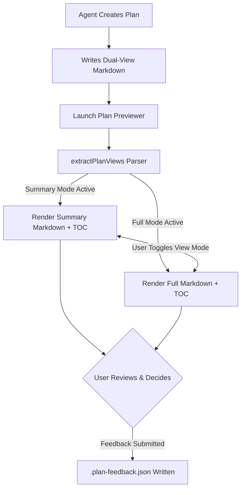

<!-- SUMMARY -->
# Plan Previewer: Dual-View Architecture (Summary & Full)

> [!NOTE]
> **Executive Summary**: Upgraded Plan Previewer so agents author two distinct text views: a **Summary View** (30-second executive scan with high-level strategy, decisions, and milestones) and a **Full View** (in-depth engineering specification with architecture diagrams, schema migrations, and code diffs).

---

## Key Decisions

> [!CHOICE] Default Initial View
> **Question**: Which view mode should Plan Previewer present first when opening a plan?
> - (x) **Option A**: Summary View (Clean 30-second executive digest) [Recommended]
> - ( ) **Option B**: Full View (Complete engineering specifications and code)

> [!CHOICE] Section Delimiter Syntax
> **Question**: Which delimiter syntax feels most natural for agents writing dual-view markdown plans?
> - (x) **Option A**: `<!-- SUMMARY -->` and `<!-- FULL -->` comments [Recommended]
> - ( ) **Option B**: `<div data-view="summary">` and `<div data-view="full">` HTML tags

> [!QUESTION] Additional Section Suggestions
> **Question**: Are there any additional specialized views or metadata you would like supported in future releases?

---

## High-Level Milestones

- [x] 1. Add `extractPlanViews()` parser to extract separate Summary and Full texts
- [x] 2. Wire Header View Mode toggle (`Summary` vs `Full`) to switch active text document
- [x] 3. Generate independent Outline (TOC) sidebar specifically for the active view
- [x] 4. Update `rich-plan-formatting` and `plan-previewer` skills with dual-view guidelines
- [x] 5. Verify all tests pass and live polling syncs across views
<!-- /SUMMARY -->

<!-- FULL -->
# Plan Previewer: Dual-View Architecture (Full Specification)

## 1. Objective & Motivation
Human reviewers need to scan plans in 30 seconds to understand the big picture and make architectural decisions without being overwhelmed by hundreds of lines of code diffs, database migrations, and edge-case specifications. At the same time, when executing or conducting deep technical reviews, the full engineering specification must be preserved in the exact same plan file.

Instead of merely hiding DOM elements via CSS, Plan Previewer now supports **two distinct textual views** authored directly in the plan markdown file:
1. `<!-- SUMMARY --> ... <!-- /SUMMARY -->`: The executive digest.
2. `<!-- FULL --> ... <!-- /FULL -->`: The comprehensive engineering blueprint.

---

## 2. System Architecture & Lifecycle



---

## 3. Decisions & Options

> [!CHOICE] Default Initial View
> **Question**: Which view mode should Plan Previewer present first when opening a plan?
> - (x) **Option A**: Summary View (Clean 30-second executive digest) [Recommended]
> - ( ) **Option B**: Full View (Complete engineering specifications and code)

> [!CHOICE] Section Delimiter Syntax
> **Question**: Which delimiter syntax feels most natural for agents writing dual-view markdown plans?
> - (x) **Option A**: `<!-- SUMMARY -->` and `<!-- FULL -->` comments [Recommended]
> - ( ) **Option B**: `<div data-view="summary">` and `<div data-view="full">` HTML tags

> [!QUESTION] Additional Section Suggestions
> **Question**: Are there any additional specialized views or metadata you would like supported in future releases?

---

## 4. Technical Implementation Details

```javascript
// Parser logic in public/app.js
function extractPlanViews(content) {
  if (!content || typeof content !== 'string') {
    return { hasDualViews: false, summaryContent: '', fullContent: content || '' };
  }

  const summaryMatch = content.match(/<!--\s*(?:SECTION:\s*)?SUMMARY(?:_START)?\s*-->([\s\S]*?)<!--\s*(?:\/|END\s+|END_)?(?:SECTION:\s*)?SUMMARY(?:_END)?\s*-->/i);
  const fullMatch = content.match(/<!--\s*(?:SECTION:\s*)?FULL(?:_START)?\s*-->([\s\S]*?)<!--\s*(?:\/|END\s+|END_)?(?:SECTION:\s*)?FULL(?:_END)?\s*-->/i);

  if (summaryMatch && fullMatch) {
    return {
      hasDualViews: true,
      summaryContent: summaryMatch[1].trim(),
      fullContent: fullMatch[1].trim()
    };
  }

  return { hasDualViews: false, summaryContent: content, fullContent: content };
}
```

---

## 5. File Changes

| File | Action | Description |
|---|---|---|
| `public/app.js` | `[MODIFY]` | Added `extractPlanViews()`, dynamic view re-rendering, and independent TOC generation |
| `skills/rich-plan-formatting/SKILL.md` | `[MODIFY]` | Added dual-text structure protocol and examples |
| `skills/plan-previewer/SKILL.md` | `[MODIFY]` | Documented dual-view authoring requirement in agent workflow |
| `src/rule-block.js` | `[MODIFY]` | Updated global agent instructions to require dual-view structure |
| `README.md` | `[MODIFY]` | Added dual-view documentation and delimiter specifications |

---

## 6. Verification & Automated Test Suite

- Run test suite: `npm test`
- Verification checkpoints:
  - Switching between Summary and Full modes re-renders the appropriate text section.
  - Outline (TOC) sidebar dynamically updates to show headings from the active view.
  - Selections in Decisions Tray persist across view switches.
  - Single-view plans (without delimiter tags) gracefully render across both view modes.
<!-- /FULL -->
