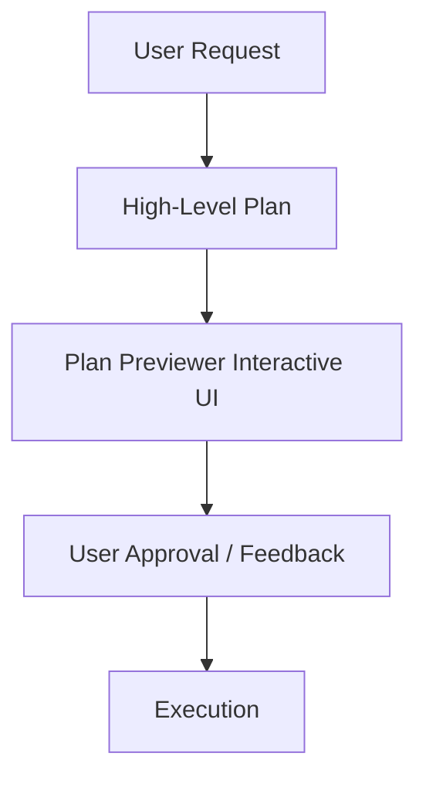

# Rich Plan Formatting Guide: Human-Readable First

When authoring execution plans (such as `plan.md` or `PLAN.md`), your goal is **maximum human readability with progressive disclosure**. 

> [!IMPORTANT]
> **The 30-Second Rule**: A human reviewer must be able to scan and understand the **Goal**, **Key Decisions**, and **High-Level Strategy** in under 30 seconds without wading through walls of code or verbose paragraphs.
>
> Put deep implementation details, long file diffs, command sequences, and exhaustive edge cases inside **collapsible `<details>` blocks**!

---

## 1. Plan Structure Template

Follow this standardized, clean structure:

```markdown
# [Short Descriptive Title]

> [!NOTE]
> **Executive Summary / Goal**: 1–2 sentences explaining what is being built or fixed and why.

## Strategy & Approach
- **Core concept**: Brief 1-2 sentence description.
- **Key milestones**: High-level stages (3–5 bullets max).

> [!CHOICE] Key Decision Block (if trade-offs exist)
> **Question**: Which approach should we take for X?
> - (x) **Option A**: Approach 1 [Recommended]
> - ( ) **Option B**: Approach 2

## Execution Milestones
- [ ] 1. Core architecture & setup
- [ ] 2. Implementation of primary modules
- [ ] 3. Tests & verification

<details>
<summary>🔍 Deep Dive: Technical Implementation Details</summary>

### Step-by-Step Breakdown
1. **Module A (`src/moduleA.js`)**: Add X handler with Y signature.
2. **Module B (`src/moduleB.js`)**: Refactor Z logic.

```javascript
// Keep code snippets short and focused on critical interfaces
function example() { ... }
```
</details>

<details>
<summary>📁 File Changes Summary (X files)</summary>

- `src/core.js` `[MODIFY]`: Add helper method.
- `src/new-feature.js` `[NEW]`: Module implementation.
- `tests/feature.test.js` `[NEW]`: Unit tests.
</details>

<details>
<summary>🧪 Verification & Testing Plan</summary>

- Run automated test suite: `npm test`
- Manual verification steps:
  1. Step 1 ...
  2. Step 2 ...
</details>
```

---

## 2. Progressive Disclosure via Collapsible `<details>` Blocks

Never paste long code snippets, extensive file listings, or deep architectural deep-dives directly into the main plan body. Wrap them in `<details><summary>`:

- `<details><summary>🔍 Deep Dive: Architecture & Implementation Details</summary> ... </details>`
- `<details><summary>📁 File Changes Breakdown (X files)</summary> ... </details>`
- `<details><summary>🧪 Detailed Testing & Edge Cases</summary> ... </details>`
- `<details><summary>⚙️ Command Sequences & Configuration</summary> ... </details>`

Plan Previewer renders these as sleek, interactive accordions that can be expanded with one click or collapsed globally in **Summary View**.

---

## 3. Interactive Choice Cards & Open Questions

For key trade-offs or design decisions, use interactive choice and question blocks. Plan Previewer renders them as clickable selection cards:

```markdown
> [!CHOICE] Database Architecture Choice
> **Question**: Which caching system should we implement for the query layer?
> - (x) **Option A**: Redis (Fast in-memory storage, pub/sub) [Recommended]
> - ( ) **Option B**: Memcached (Simple key-value cache)
> - ( ) **Option C**: SQLite in-memory cache (Zero dependencies)

> [!QUESTION] Legacy Data Migration
> **Question**: Do we need to run a background migration script for legacy user data before deploying?
```

---

## 4. GitHub Alert Callouts

Use callouts sparingly to draw focus to critical points:
- `> [!NOTE]` for executive summaries and context.
- `> [!IMPORTANT]` for core requirements and critical invariants.
- `> [!TIP]` for optimization opportunities or best practices.
- `> [!WARNING]` for breaking changes, caveats, or potential regressions.
- `> [!CAUTION]` for destructive actions or data loss risks.

---

## 5. File Badges & Risk Tags

Tag files and sections with high-contrast inline markers:
- `[NEW]` for new files being created.
- `[MODIFY]` for existing files being edited.
- `[DELETE]` for files being removed.
- `[HIGH RISK]` or `[LOW RISK]` for section risk indicators.

---

## 6. Mermaid Visual Diagrams

For complex flows, use simple Mermaid diagrams:


