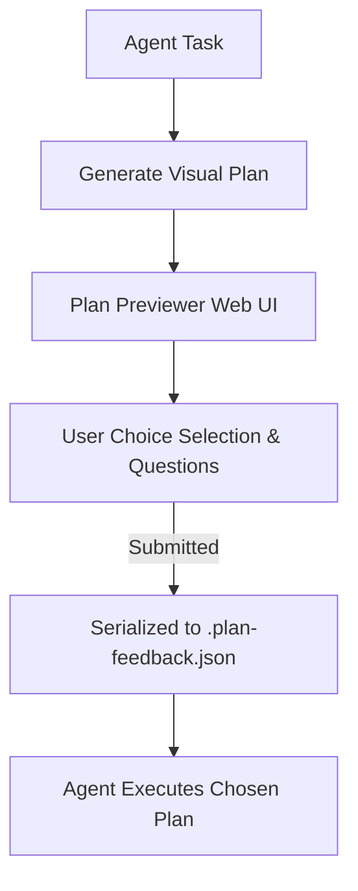

# Rich Plan Formatting Guide

When creating execution plans (such as `plan.md` or `PLAN.md`), structure them to be visual, highly readable, and interactive for the user in **Plan Previewer**.

## Key Formatting Standards

### 1. Interactive Choice Cards & Open Questions
When the plan has trade-offs or underspecified options, write interactive choice or question blocks. Plan Previewer will render them as interactive radio selection cards and question input boxes:

```markdown
> [!CHOICE] Database Architecture Choice
> **Question**: Which caching system should we implement for the database query layer?
> - (x) **Option A**: Redis (Fast in-memory storage, supports pub/sub) [Recommended]
> - ( ) **Option B**: Memcached (Simple key-value cache)
> - ( ) **Option C**: PostgreSQL UNLOGGED table (No extra dependency)

> [!QUESTION] Data Migration Requirement
> **Question**: Do we need to run a background migration script for legacy user data before deploying?
```

### 2. GitHub Alert Callouts
Use GitHub blockquote alert syntax to emphasize critical information, warnings, or design decisions:
- `> [!NOTE]` for background context and helpful notes.
- `> [!TIP]` for optimization ideas or best practices.
- `> [!IMPORTANT]` for key requirements and critical steps.
- `> [!WARNING]` for edge cases, breaking changes, or potential risks.
- `> [!CAUTION]` for high-risk data loss or destructive actions.

### 3. File Badges & Risk Levels
Use inline demarcations on component/file headings:
- `[NEW]` for new files being created.
- `[MODIFY]` for existing files being edited.
- `[DELETE]` for files being removed.
- `[HIGH RISK]` or `[LOW RISK]` for section risk indicators.

### 4. Mermaid Visual Diagrams
Use standard markdown ````mermaid``` code blocks to visually illustrate flowcharts, sequence diagrams, and module dependencies:



### 5. Interactive Task Checklists
Use standard task list items so Plan Previewer can automatically compute and display progress:
- [ ] Step 1: Core setup
- [ ] Step 2: Implementation
- [ ] Step 3: Verification tests
