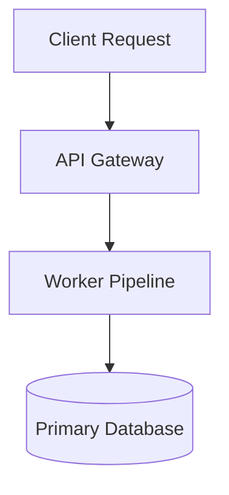

# Rich Plan Formatting Guide: Dual-View Architecture (Summary & Full)

When authoring execution plans (such as `plan.md` or `PLAN.md`), you MUST structure the file into **two distinct text sections**:
1. **Summary View (`<!-- SUMMARY --> ... <!-- /SUMMARY -->`)**: A concise, 30-second executive scan containing high-level strategy, key trade-off decisions, and high-level milestones.
2. **Full View (`<!-- FULL --> ... <!-- /FULL -->`)**: The comprehensive engineering specification containing architectural diagrams, schema migrations, step-by-step implementation breakdowns, file diff tables, and verification suites.

Plan Previewer automatically parses these two sections and lets the user switch between **Summary Mode** and **Full Mode** with independent outline navigation (TOC).

---

## 1. Dual-View Plan Template

Always format your plans using this standardized dual-view template:

```markdown
<!-- SUMMARY -->
# [Project Name / Task Title] (Executive Summary)

> [!NOTE]
> **Executive Summary**: 1–2 sentences explaining what is being built or fixed, key trade-offs, and estimated effort.

## High-Level Strategy & Architecture
- **Core Concept**: Brief 1-2 sentence description of the solution.
- **Key Milestones**: 3–5 bullet summary of execution stages.

## Key Decisions

> [!CHOICE] Key Architectural Decision
> **Question**: Which approach should we take for X?
> - (x) **Option A**: Approach 1 (Fast, reliable, standard) [Recommended]
> - ( ) **Option B**: Approach 2 (Custom, flexible)

> [!QUESTION] Requirement Clarification
> **Question**: Are there any specific constraints on Y we should adhere to?

## Execution Milestones
- [ ] 1. Foundation & core abstractions
- [ ] 2. Primary service implementation
- [ ] 3. End-to-end verification & tests
<!-- /SUMMARY -->

<!-- FULL -->
# [Project Name / Task Title] (Full Specification)

## 1. Objective & Background
Comprehensive context explaining why this change is necessary, current latency/error metrics, service boundaries, and dependencies.

## 2. Architecture & Component Flow



## 3. Decisions & Trade-Offs

> [!CHOICE] Key Architectural Decision
> **Question**: Which approach should we take for X?
> - (x) **Option A**: Approach 1 (Fast, reliable, standard) [Recommended]
> - ( ) **Option B**: Approach 2 (Custom, flexible)

> [!QUESTION] Requirement Clarification
> **Question**: Are there any specific constraints on Y we should adhere to?

## 4. Data Model & Schema Migrations
```sql
-- Migration details or code snippets
create table example (
  id uuid primary key default gen_random_uuid(),
  created_at timestamptz not null default now()
);
```

## 5. Step-by-Step Implementation Breakdown
1. **Module A (`src/moduleA.js`)**: Add X handler with Y signature.
2. **Module B (`src/moduleB.js`)**: Refactor Z logic.

## 6. File Changes Breakdown

| File | Action | Description |
|---|---|---|
| `src/core.js` | `[MODIFY]` | Add helper method for event dispatch |
| `src/new-service.js` | `[NEW]` | Implement worker service logic |
| `tests/service.test.js` | `[NEW]` | Add unit and integration tests |

## 7. Verification & Automated Test Plan
- Run automated test suite: `npm test`
- Manual verification steps:
  1. Trigger test event via CLI.
  2. Verify correct database record creation.
<!-- /FULL -->
```

---

## 2. Supported Section Delimiter Formats

Plan Previewer recognizes several delimiter styles (HTML comments are recommended):

- **HTML Comments (Recommended)**:
  ```markdown
  <!-- SUMMARY -->
  ... summary content ...
  <!-- /SUMMARY -->

  <!-- FULL -->
  ... full specification content ...
  <!-- /FULL -->
  ```
- **HTML Container Tags**:
  ```markdown
  <div data-view="summary">
  ... summary content ...
  </div>

  <div data-view="full">
  ... full specification content ...
  </div>
  ```

---

## 3. Interactive Choice & Question Blocks

For key trade-offs or design decisions, use interactive choice and question blocks. Plan Previewer groups them into a unified **Decisions Tray** (`D1`, `D2`, `Q1`) with a live resolution counter:

```markdown
> [!CHOICE] Database Architecture Choice
> **Question**: Which caching system should we implement for the query layer?
> - (x) **Option A**: Redis (Fast in-memory storage, pub/sub) [Recommended]
> - ( ) **Option B**: Memcached (Simple key-value cache)
> - ( ) **Option C**: SQLite in-memory cache (Zero dependencies)

> [!QUESTION] Legacy Data Migration
> **Question**: Do we need to run a background migration script for legacy user data before deploying?
```

---

## 4. GitHub Alert Callouts

Use callouts to draw focus to critical points:
- `> [!NOTE]` for executive summaries and context.
- `> [!IMPORTANT]` for core invariants and non-negotiable requirements.
- `> [!TIP]` for optimization opportunities or best practices.
- `> [!WARNING]` for breaking changes, caveats, or potential regressions.
- `> [!CAUTION]` for destructive actions or data loss risks.

---

## 5. File Badges & Risk Tags

Tag files and sections with high-contrast inline markers:
- `[NEW]` for new files being created.
- `[MODIFY]` for existing files being edited.
- `[DELETE]` for files being removed.
- `[HIGH RISK]` / `[LOW RISK]` for operational risk indicators.
