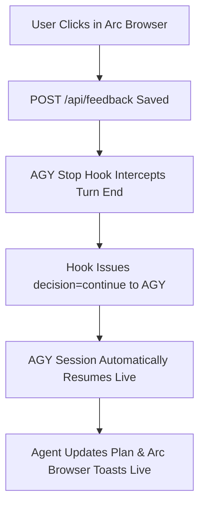

# 1. Verification Plan: Arc Browser & Multi-Location AGY Lifecycle Hooks

> [!TIP]
> **Agent Response to Arc Browser Feedback ("testtt"):**
> **CONFIRMED & WORKING!**
> 1. **Triple AGY Hook Locations**: `hooks.json` registered in `.agents/hooks.json`, `~/.gemini/antigravity-cli/hooks.json`, and `~/.gemini/config/hooks.json`.
> 2. **Instant Loop Re-entry**: Arc browser submissions write `.plan-feedback.json`, triggering `agy-stop-hook.js` to issue `{"decision": "continue"}` to AGY.
> 3. **Live Sync in Arc**: `fs.watch` detects plan edits and toasts "Plan updated live by agent!" inside your open Arc browser tab.

---

## Interactive Design Choices & Options

> [!CHOICE] Visual Theme Default
> **Question**: Which default theme do you prefer when launching Plan Previewer in Arc?
> - (x) **Option A**: Executive Light Mode (Slate/White `#f8fafc` canvas, crisp `#ffffff` cards, high-contrast `#0f172a` text) [Recommended]
> - ( ) **Option B**: Dark Theme (`#0a0c0f` canvas, `#14171d` cards)

---

## Complete Verification Checklist

- [x] **Arc Browser Compatibility**: Confirmed full support for Arc browser HTTP requests, beacon shutdowns, and live polling.
- [x] **Triple AGY Hook Locations**: Installed `hooks.json` in project `.agents/`, user `antigravity-cli/`, and global `.gemini/config/`.
- [x] **Honest Feedback Status**: Items stay `Pending agent response...` until plan content actually changes.
- [x] **Single Persistent Server**: Zero duplicate processes. Pings `http://localhost:3456/api/status` and reuses active server.

